# 💫 About Me:

I&apos;m  Renaldy Hidayat a Computer Science candidate at Nusa Mandiri University, and
I&apos;m deeply passionate about programming. My journey in the world
of technology has been an exciting adventure, driven by the endless
opportunities for learning. Whether it&apos;s exploring cutting-edge
programming languages, leveraging groundbreaking frameworks, or
applying technology in innovative ways, I&apos;m always up for the
challenge. Staying updated with the latest developments is a priority,
as I strive to incorporate them into my work.

My dedication to turning hobbies into meaningful projects is a source
of fulfillment. It allows me to merge creativity with technical
expertise. Crafting web applications and developing software solutions
are areas where I find immense satisfaction, bringing ideas to life
through code. Above all, my commitment to continuous improvement
drives my journey. I firmly believe that success in the tech world is
rooted in lifelong learning. Every day is an opportunity to expand my
knowledge, refine my skills, and embrace new challenges head-on. This
unwavering dedication keeps me pushing the boundaries.

## 🌐 Socials:

  

# 💻 Tech Stack:

            

# 📊 GitHub Stats:

### ✍️ Random Dev Quote

---

