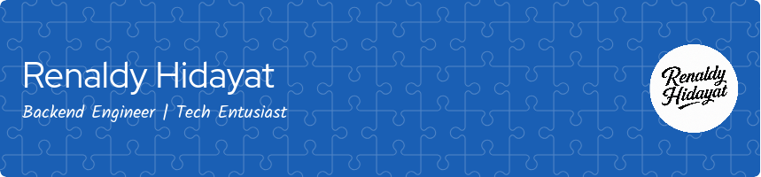

---

I'm a **Software Engineer** with a deep passion for backend development and building reliable, scalable systems. I enjoy working with modern programming languages and technologies to create clean, maintainable, and high-performing applications.

Skilled in **Golang, Python, Java, Rust, PHP, JavaScript, and TypeScript**, I focus on developing APIs, designing microservices architectures, and integrating robust messaging systems like **Kafka** and **RabbitMQ**. My enthusiasm for programming drives me to turn hobbies into impactful, real-world projects—combining creativity with strong technical execution.

I stay actively engaged with the latest tech trends, continuously refining my skills and applying them across a wide range of use cases—from payment systems to recommendation engines and developer tools.

---

  
  
  

---

### 🛠️ Tech Stack

- **Languages**: Go, Python, Java, Rust, TypeScript, PHP, JavaScript  
- **Frameworks**: Echo, Fiber, Django, FastAPI, Spring Boot, Laravel, NestJS, Express  
- **Messaging & Communication**: Kafka, RabbitMQ, gRPC, NATS  
- **Database**: PostgreSQL, MySQL, Redis, SQLite, MongoDB  
- **DevOps & Tools**: Docker, Linux, GitHub Actions, NGINX

---

### 📌 Featured Projects

- 🔗 [**Ecommerce FastAPI + PayPal**](https://github.com/renaldyhidayatt/ecomfastapireact) – FastAPI-based eCommerce with PayPal and Swagger UI
- 🔗 [**Microservice Ecommerce (NestJS)**](https://github.com/renaldyhidayatt/MicroserviceTcpNestReact) – Modular microservices using NestJS, PostgreSQL, Midtrans, and RajaOngkir
- 🔗 [**Product Recommendation with Django-React**](https://github.com/renaldyhidayatt/django_react_recommendation_product) – Sentiment-based recommendation system
- 🔗 [**Ecommerce Go-Fiber**](https://github.com/renaldyhidayatt/ecommerce_fiber_gorm) – Built with Fiber, gRPC, PostgreSQL, and Tauri
- 🔗 [**Prodigio ERP(Laravel)**](https://github.com/renaldyhidayatt/prodigio-erp-public-main) – ERP system for construction companies
- 🔗 [**Payment Gateway with gRPC**](https://github.com/renaldyhidayatt/payment-gateway-grpc) – Secure payment gateway using Echo, gRPC, SQLC
- 🔗 [**Personal Finance App**](https://github.com/renaldyhidayatt/personal-financial-management.git) – Built with Tauri, React, Zustand, and SQLite

👉 [See my full portfolio here »](https://renaldyhidayatt.github.io/portofolio)

---

## 🏆 GitHub Trophies

---

### 📈 GitHub Stats

  
  

### 📈 Wakatime Stats

  

    
    
  

<!--START_SECTION:waka>

<!--END_SECTION:waka-->

